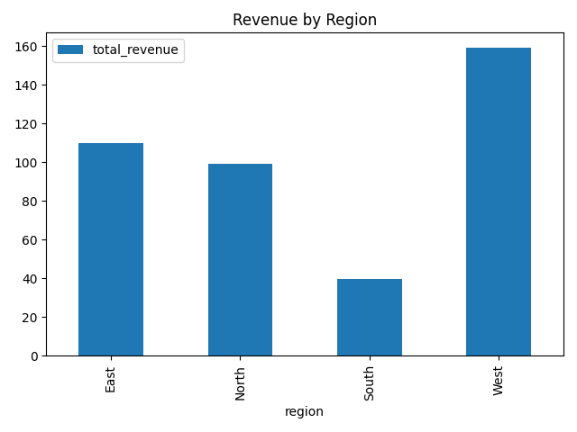

<div align="center">

# dataflow-databricks-sample

<a href=".github/workflows/ci.yml"></a>
<a href="LICENSE"></a>


</div>

This repository demonstrates a mini dataflow pipeline using a Databricks-style bronze/silver/gold architecture. It’s a beginner-friendly portfolio project for data engineers. The pipeline ingests CSV data, cleans and transforms it, and produces a final analytics table (e.g., total revenue per region).

---

## Preview

<p align="center">
  
</p>

Generate the image (and a small GIF) locally:
```bash
FORCE_PANDAS=1 python scripts/generate_demo.py
```
Creates `assets/demo.png` and, if possible, `assets/demo.gif`.

---

## Why this project is resume-ready
- **Databricks-style flow**: bronze → silver → gold pattern with clear separation of concerns.
- **Spark or Pandas**: Runs with PySpark if available, else Pandas fallback for quick local demos.
- **CI + tests**: One-click verification via GitHub Actions and pytest.
- **Notebooks + CLI**: Works as notebooks or as a single CLI pipeline for flexibility.

---

## Architecture
```mermaid
flowchart LR
    A[Raw CSV (data/raw)] --> B[Bronze<br/>cleaned_sales.parquet]
    B --> C[Silver<br/>sales_transformed.parquet<br/>(+ total_amount, validation)]
    C --> D[Gold<br/>sales_summary.parquet<br/>(revenue by region, AOV)]
```

---

## Quickstart
```bash
# 1) Install deps
pip install -r requirements.txt

# 2) Run the pipeline (Pandas fallback if you don't have Java/Spark)
FORCE_PANDAS=1 python src/pipeline.py

# 3) See outputs
ls -1 data/bronze data/silver data/gold

# 4) Run tests
FORCE_PANDAS=1 pytest -q

# 5) Generate demo visuals
FORCE_PANDAS=1 python scripts/generate_demo.py
```

---

## What you get (outputs)
- `data/bronze/cleaned_sales.parquet` – cleaned names, parsed dates, nulls removed
- `data/silver/sales_transformed.parquet` – adds `total_amount = quantity * unit_price` and validates
- `data/gold/sales_summary.parquet` – aggregated by `region` with `total_revenue` and `avg_order_value`
- `assets/demo.png` / `assets/demo.gif` – bar chart of revenue by region

---

## Notebooks (Databricks-friendly)
- `notebooks/01_ingest.ipynb` → Bronze
- `notebooks/02_transform.ipynb` → Silver
- `notebooks/03_analytics.ipynb` → Gold + chart
- Python versions for Databricks import: `notebooks_py/01_ingest.py`, `02_transform.py`, `03_analytics.py`

---

## Project Structure
```
dataflow-databricks-sample/
├── data/
│   ├── raw/
│   ├── bronze/
│   ├── silver/
│   └── gold/
├── notebooks/
│   ├── 01_ingest.ipynb
│   ├── 02_transform.ipynb
│   └── 03_analytics.ipynb
├── notebooks_py/
│   ├── 01_ingest.py
│   ├── 02_transform.py
│   └── 03_analytics.py
├── src/
│   ├── utils.py
│   └── pipeline.py
├── tests/
│   └── test_pipeline.py
├── scripts/
│   └── generate_demo.py
├── .github/workflows/ci.yml
├── requirements.txt
├── README.md
├── .gitignore
└── LICENSE
```

---

## Tech highlights
- Python 3.10+, Pandas, PySpark (optional), PyArrow, Matplotlib, PyTest
- Clean, typed helpers in `src/utils.py`
- Simple CLI orchestrator in `src/pipeline.py`
- CI via GitHub Actions (`.github/workflows/ci.yml`)

---

## Attribution & License
MIT License. See `LICENSE`.
